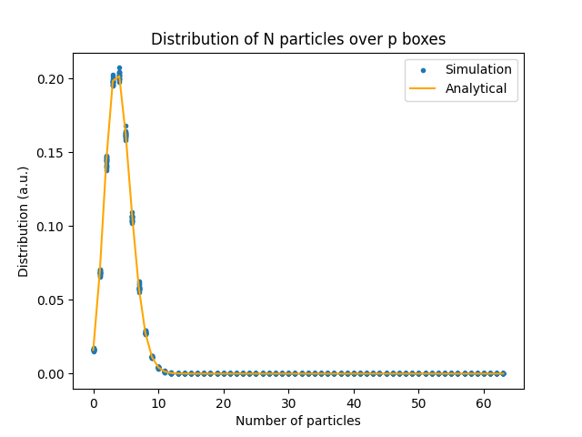
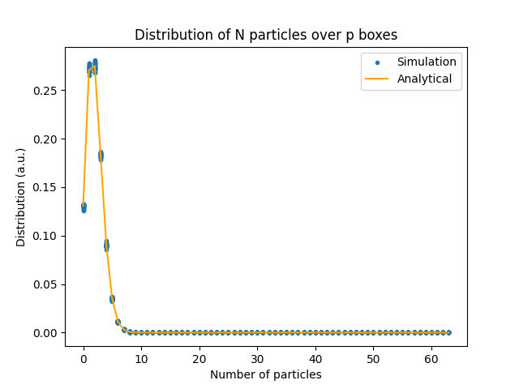
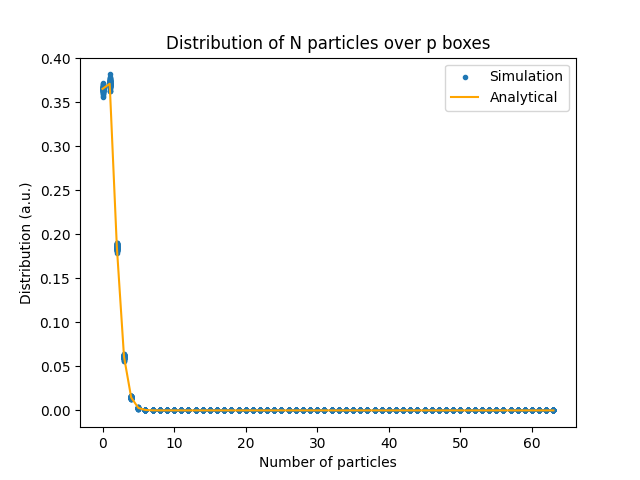

# Solution

This problem is similar to placing $n$ indistinguishable balls (particles) into $p$ distinguishable boxes (compartments in the space). The probability of finding a box has $x$ balls is

$$C_n^x(\frac{1}{p})^{x}(\frac{p-1}{p})^{n-x}$$

which follows a binominal distribution. The mode of this distribution is $(n+1)/p$. Thus when the number of compartments increases, the most common number of ball in a box decreases. As shown in the following pictures. In these pictures, the particle number is 64, and the number of compartments are from top to bottom 16, 32, 64, respectively.

  

The number of ways to placing these particles into compartments is

$${n+p-1\choose p-1}.$$

The number of ways to ensure that at least one particle is in each compartment is

$${n-1\choose p-1}.$$

Thus the probability to find at least one empty box is

$$1-\frac{{n-1\choose p-1}}{{n+p-1\choose p-1}}=\frac{(n-p+1)(n-p+2)\cdots n}{n(n+1)(n+2)\cdots (n+p-1)}\rightarrow 0,\ as\ n\rightarrow \infty$$