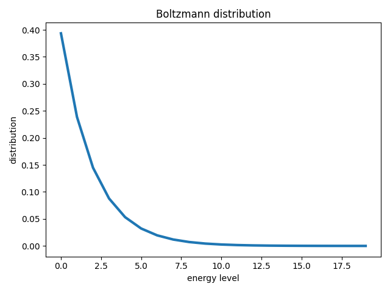
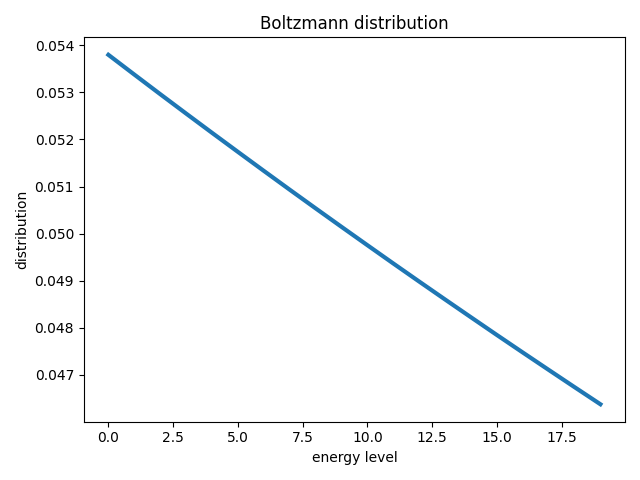
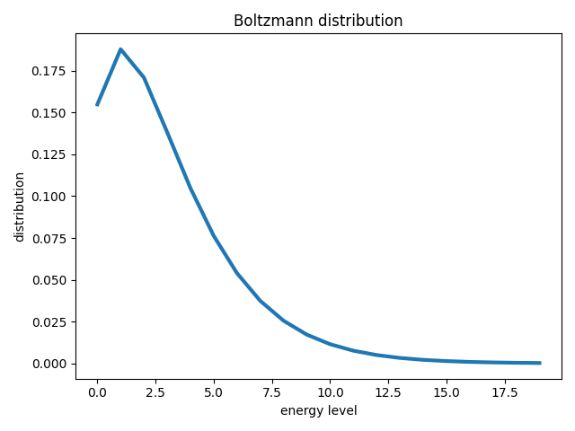
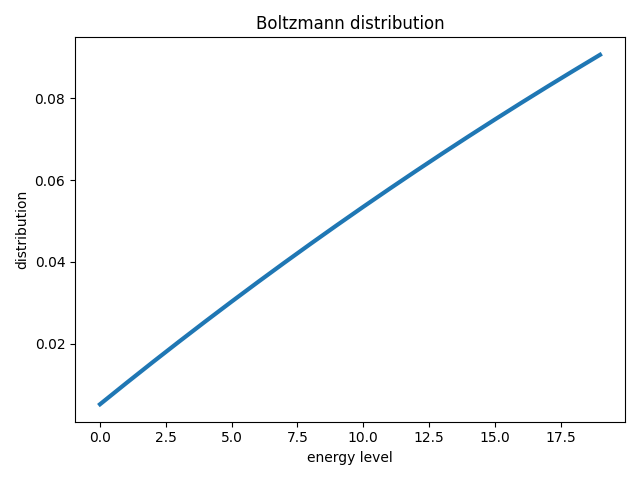

# Solution
The occupancy of a certain level can be calculated by

$$ O_i=\frac{g_i\times \exp{-\frac{E_i}{k_BT}}}{Q}$$

where $g_i$ is the degeneracy of energy levels, $i$ is the energy level, $E_i$ is its energy, $k_B$ is
the Boltzmann constant and $Q$ is the partition function. When at high temperatures, we have

$$ O_i\rightarrow \frac{g_i}{Q},\ as\ T\rightarrow\infty$$

the occupancy is propotional to the degeneracy.

Thus, for the non-degenerate system, the occupancy of different level is close to the same at high temperature. (top: $T=1$, bottom: $T=64$)

For the degenerate system for which the degeneracy of level $i$ is $i+1$, the higher energy level has more occupancy. (top: $T=1$, bottom: $T=64$)

For a linear rotor, its partation function can be calculated by

$$Q=\frac{2I}{\beta\hbar^2}=\frac{2}{\beta},\ \frac{I}{\hbar^2}=1$$

which holds when $\Theta_r/T\leq 0.01$, where $\Theta_r=\frac{\hbar^2}{2I}=\frac{1}{2}$

Let's check this

|$Q_{analytical}$ |$Q_{calculated}$ |${\Theta_r}/T$ |
|-----------------|-----------------|---------------|
|1                |1.895264         |0.5            |
|2                |3.118808         |0.25           |
|4                |5.464034         |0.125          |
|8                |9.969141         |0.0625         | 
|16               |18.694003        |0.03125        |
|32               |35.725971        |0.015625       |
|64               |69.189985        |0.0078125      |
|128              |135.263539       |0.00390625     |
|256              |266.198142       |0.00195312     |
|512              |526.349792       |0.000976562    |