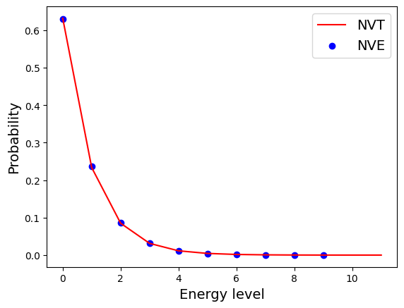

# Solution
The energy distribution of the first oscillator recovers a Boltzmann distribution

The energy distribution of the others is also a Boltzmann-like distribution. It has a form

$$P(E_2) \propto \exp\{-\frac{E_1}{k_BT}\}=\exp\{\frac{E_2-E_{tot}}{k_BT}\}$$

where $E_1$ is the energy for the first oscillator and $E_2$ is the energy for the remaining. Thus its distribution is like

The distribution of the first oscillator mentioned above is almost the same as the canonical distribution

This is because if we treat the first oscillator as a small system and the reservoir as a heat bath with which it can exchange energy with, the small system behaves as a NVT system and thus follows the canonical distribution.

|# of Oscillator |Initial Enegry |Average Energy of 1st Oscillator |
|----------------|---------------|---------------------------------|
|4               |40             |9.938633                         |
|8               |80             |10.223286                        |
|16              |160            |9.009939                         |
|32              |320            |9.037367                         |
|64              |640            |9.495612                         |
|128             |1280           |9.480653                         |
|256             |2560           |9.265551                         |
|512             |5120           |9.752776                         |
|1024            |10240          |10.752469                        |