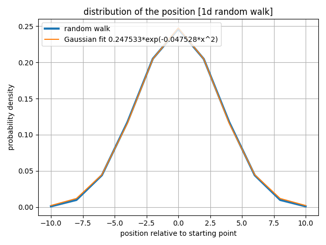
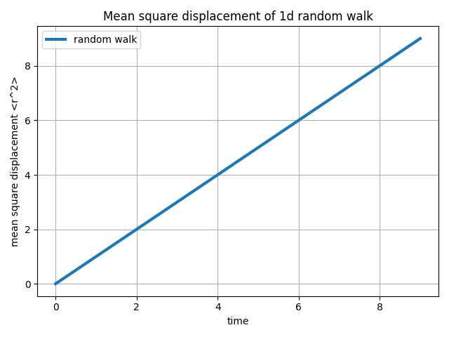
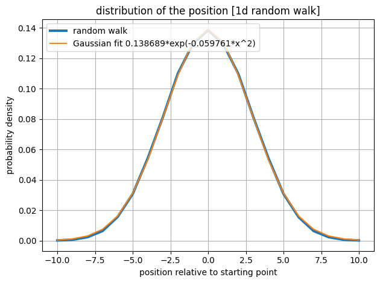
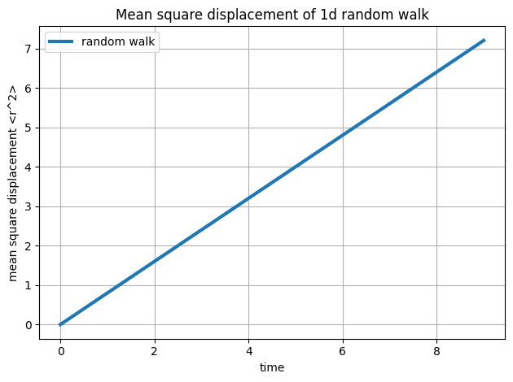

# Solution

To reach the position $n$ after $N$ steps, the particle must take $\frac{N+n}{2}$ steps forward and $\frac{N-n}{2}$ steps back. The number of ways to do that is

$${N \choose \frac{N+n}{2}}$$

The number of ways to take $N$ steps is $2^N$. Thus, the probability of reaching position $n$ after $N$ steps is

$$P(n, N) = \frac{N!}{2^N \frac{N+n}{2}!\frac{N-n}{2}!}$$

Take the logarithm

$$
\begin{align*}
\ln P(n, N) = &-N\ln 2+N\ln N-\frac{N}{2}\ln(2\pi N) \\
&-\frac{N+n}{2}\ln\frac{N+n}{2}+\frac{N+n}{4}\ln\pi (N+n) \\
&-\frac{N-n}{2}\ln\frac{N-n}{2}+\frac{N-n}{4}\ln\pi (N-n) \\
=&-N\ln 2+N\ln N -\frac{N}{2}\ln 2\pi N+\frac{N}{2}\ln{4\pi}-\frac{n^2}{2N}\\
\end{align*}
$$

Thus we have
$$ P(n, N) \propto \exp{-\frac{n^2}{2N}} $$

Normalize it, we get

$$P(n, N) = \sqrt{\frac{2}{\pi N}}\exp{-\frac{n^2}{2N}}$$

The simulation result (1e7 cycles, 50 steps/cycle) is plotted below

According to the formula that we have derived, the expression of this gaussian is $0.2523\exp{-\frac{n^2}{20}}$, which matches well with the simulation result.

Below is the figure of MSD versus the time. According to the theory, the MSD is propotional to the time, and the simulation result agrees with that.

Below is the result of tuning the probability of taking a move to 0.8. It can be seen that the effective step calculated from the coefficient is about 8, and the diffusion constant is also decreased to its 80%.

