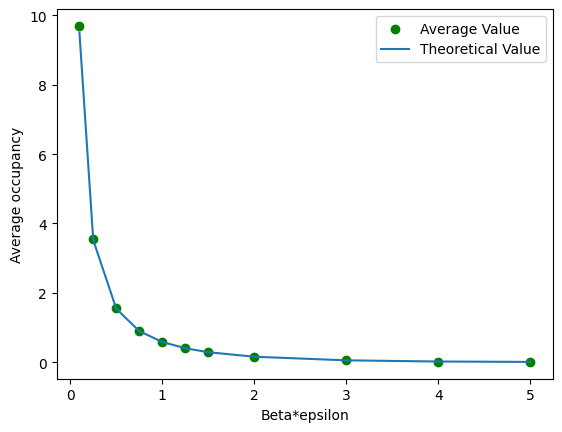
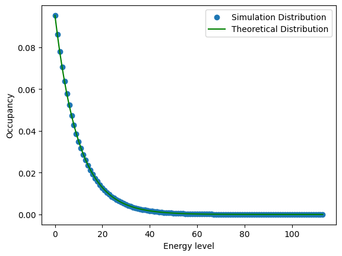

# Solution

To obey detaied balance when $n_j=0$, if the trail move is to decrease $n_j$ by 1, we cancel this move.

The algorithm fails when trial moves are performed that change $n_j$ with a random integer from the interval [−5, 5]. It also fails when only trial moves are performed that change nj with either −3 or +3, beacuse in this case, the prior probability $\alpha[0\rightarrow 1]\neq\alpha[1\rightarrow 0]=0$.

When we use the standard method, the result agrees with the analytical solution.

The following plot is at $\beta=0.10$. The simulation result agrees well with the theory.
