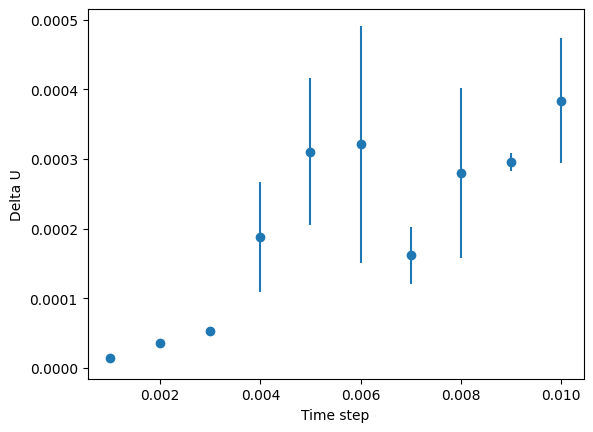

# Solution

During the initialization phase, the temperature is controlled by multiply the calculated velocity with a factor
$$ c = \sqrt{\frac{T_{expectation}}{\frac{\sum_{i=1}^N mv_{\alpha,\ i}^2(t)}{N_f}}}=\sqrt{\frac{T_{expectation}(3N-4)}{\sum_{i=1}^N mv_{\alpha,\ i}^2(t)}} $$

This scaling factor is defined based on the relationship
$$\left<v_\alpha^2\right>=k_BT/m$$
which describes the relationship between the kinetic energy and the instantaneous temperature. When performing the simulation, the instantanuous temperature sometimes deviates from the temperature we expect.
$$ T/T_{expectation}=\frac{m\left<v_\alpha^2\right>}{k_BT_{expectation}}$$

To tune the ratio to be 1, a scaling can be performed on the velocity
$$\frac{m\left<(cv_\alpha)^2\right>}{k_BT_{expectation}}=1$$
which leads to
$$c=\sqrt{\frac{k_BT_{expectation}}{m\left<v_\alpha^2\right>}}$$
and the expectation of the squared velocity is defined by
$$\left<v_\alpha^2\right>=\frac{\sum_{i=1}^{N}v_{\alpha,\ i}^2(t)}{N_f}=\frac{v_{\alpha,\ i}^2(t)}{3N-4}$$
This is how the first equation comes. Through this we can see the control over the temperature is actually a control of the kinetic energy. This helps us relax our initial structure, which might be unreasonable at first and leads to a blow up to the simulation system, and a sufficient equibilirium can help avoid this. After passing the first initialization steps, we no longer need this scaling anymore.

From the figure below, it can be seen that the drift of total energy increases with the length of the time step.

Additionally, for a given energy drift, the higher the temperature and density are, the smaller the time step is.

The implementation of the periodic boundry conditions (PBC) is to enable one to simulate a infinitly large system with countable atoms. The update of the coordinates of atoms out of the PBC box is necessary because the interactions between the atoms need to be calculated correctly.

According to [Naghizadeh, 1962](https://doi.org/10.1063/1.1732357), if atoms interact pairwise with a two parameter potention, the reduced diffusion coefficient can be defined as
$$\tilde{D}=(m/\epsilon\sigma^2)^{1/2}D$$
where $m$ is the mass of the particle, $\epsilon$ is the depth of the potential well and $\sigma$ is a length related to the size of the particle.

