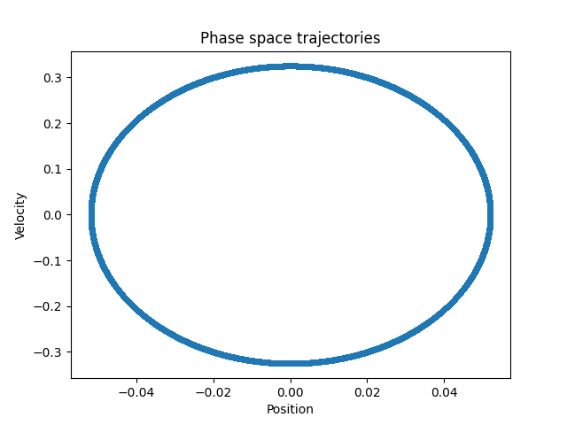
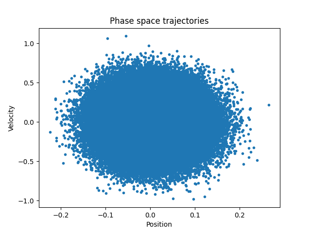
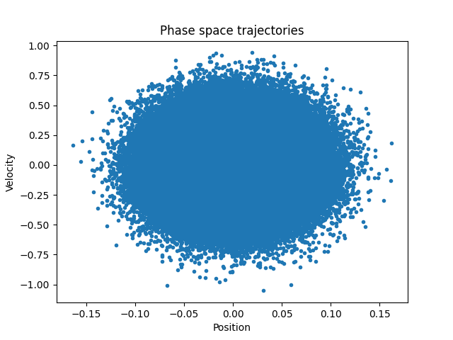
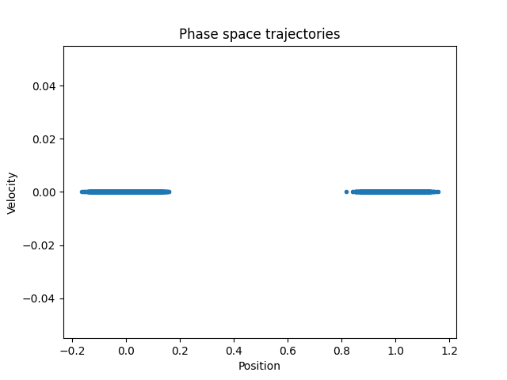
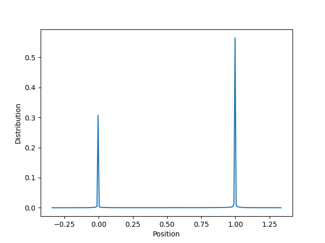
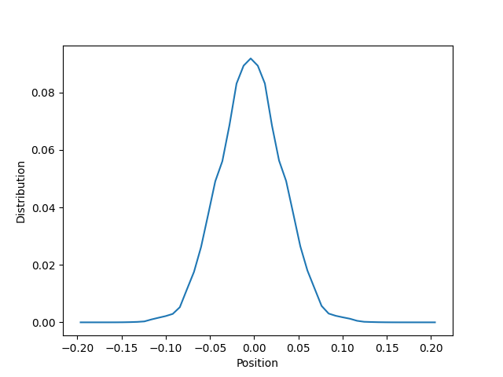
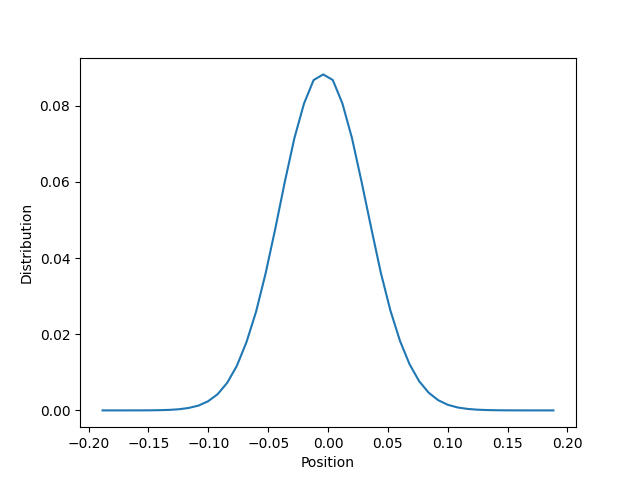
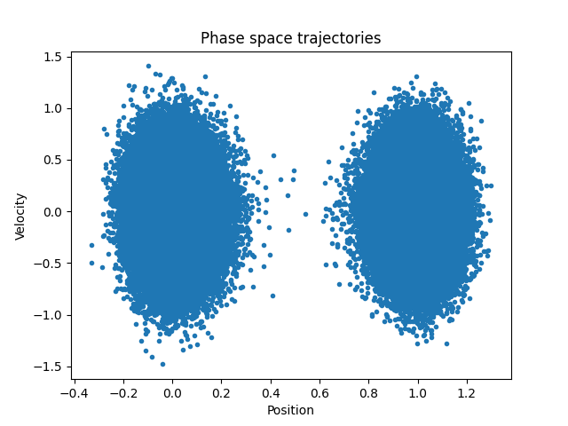

# Solution
The derivative of the energy is

$$
U'(x) = 
\begin{cases}
2\epsilon B x,\ x<0 \\
\epsilon(\sin(2\pi x)\cdot 2\pi), 0\leq x\leq 1 \\
2\epsilon B(x - 1), x > 1
\end{cases}
$$

The derivative of the force is propotional to
$$
\begin{cases}
2\epsilon B, x<0\\
\epsilon (2\pi)^2\cos(2\pi x), 0\leq x\leq 1\\
2\epsilon B, x>1\\
\end{cases}
$$

In order th ensure the continuous of the derivative of the force, $B=2\pi^2$.

The phase space trajectory of no thermostat is like

The phase space trajectory of Andersen thermostat is like

The phase space trajectory of Nose-Hoover (chain length 5) is like

The phase trajectory of MC is like

These simulations are all performed at $T=0.05$ ad $dt=0.01$. The phase space distribution of MC is different from other methods because it only takes the difference of the energy between two states into account, but not consider the energy of the intermediate states. The phase space distribution of the NVE scheme looks like a circle because this scheme is energy-conserved. That is to say, the phase trajectory is 
$$ p^2/2+kx^2=E $$
where we suggest a low energy situtation, so the $\cos$ potential can be treated like a quadratic potential.

Below is three Nose-Hoover simulation results with the Nose-Hoover chain length equals 1, 2 and 3 equally. One can see the distribution becomes canonical wher the length equals 3.

The particle is able to cross the energy barrier at $T=0.10$ with the Anderson thermostat

|Temperature |Diffusion |
|------------|----------|
|0.10        |0.00027   |
|0.20        |0.00062   |
|0.30        |0.00177   |
|0.40        |0.00553   |

|Temperature |Diffusion |
|------------|----------|
|0.10        |0.00016   |
|0.20        |0.00079   |
|0.30        |0.00245   |
|0.40        |0.00848   |