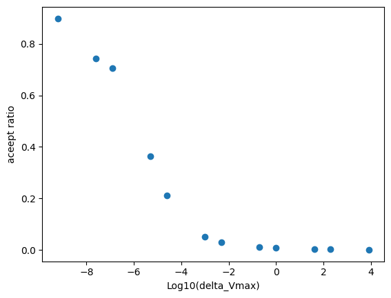
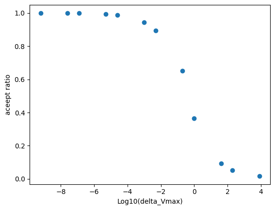

# Solution
Average density of performing a random walk in $\ln (V)$ is 0.397832.

Average density of performing a random walk in $V$ is 0.397666.

Random walk in $\ln (V)$

Random walk in $V$

The random walk in $\ln (V)$ achieves a medium accept ratio at small $\Delta V_{max}$, while the random walk in $V$ almost accept every move, wihch means lots of the move of $V$ is actually meaningless and the simulation does not reach a key point.