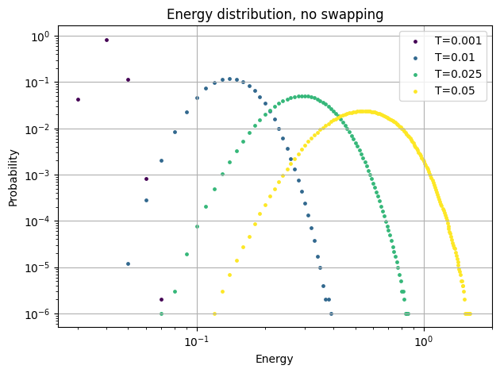

# Solution

$$\frac{\texttt{acc}(o\rightarrow n)}{\texttt{acc}(n\rightarrow o)}=\frac{\exp[-\beta_i U(j)-\beta_j U(i)]}{\exp[-\beta_i U(i)-\beta_j U(j)]}=\exp((\beta_i-\beta_j)[U(i)-U(j)])$$

The particles are able to diffuse when $T\geq 0.025$.

Below are the results of having exchange moves:

The system with the lowest energy passes the barrier when there are three system. This is reasonable, because there is no energy distribution overlapping between the system with the highest energy and the system with the lowest energy.

The equilibrium distribution with and without exchange moves are identical:

